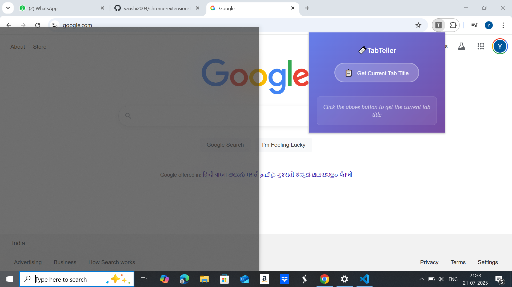
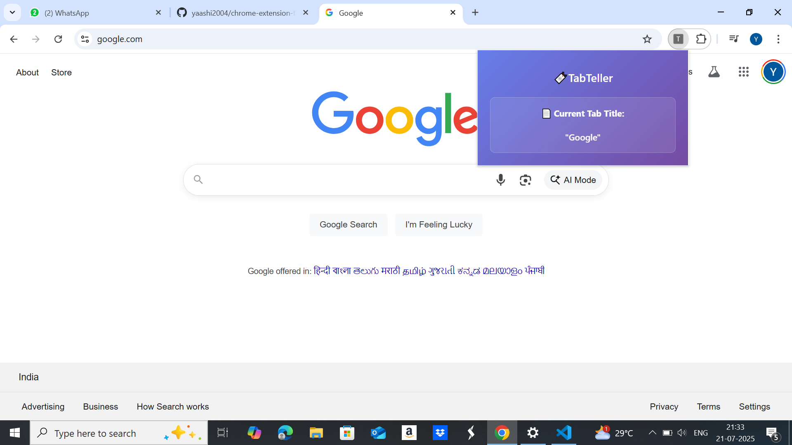

# 🚀 TabTeller – Chrome Extension

**TabTeller** is a lightweight and modern Chrome extension that displays the **title of your current active tab** instantly with a single click. Built for productivity, it helps users quickly access tab titles for reference, documentation, or multitasking purposes.

---

## 📸 Preview

### 🖼️ Popup UI  

### 🖼️ Tab Title Displayed  

---

## 💡 Features

- 🪄 One-click fetch of current tab title  
- 🧠 Minimal permissions (`activeTab`)  
- ✨ Clean, modern UI
- 🔒 Lightweight & privacy-respecting  

---

## 📂 Project Structure

TabTeller/
├── manifest.json # Extension metadata & permissions
├── popup.html # Popup UI structure
├── popup.js # Main logic to get tab title
└── screenshots/ # Demo screenshots for README

---

## 🛠️ Installation

> **Follow these steps to run the extension locally:**

1. Download or clone this repository:

   git clone https://github.com/your-username/TabTeller.git

  2. Open Chrome and navigate to:
chrome://extensions

3.Enable Developer Mode (top-right corner)

4.Click Load unpacked

5.Select the folder where this extension is saved.

6.The TabTeller icon should now appear in your extensions bar!
